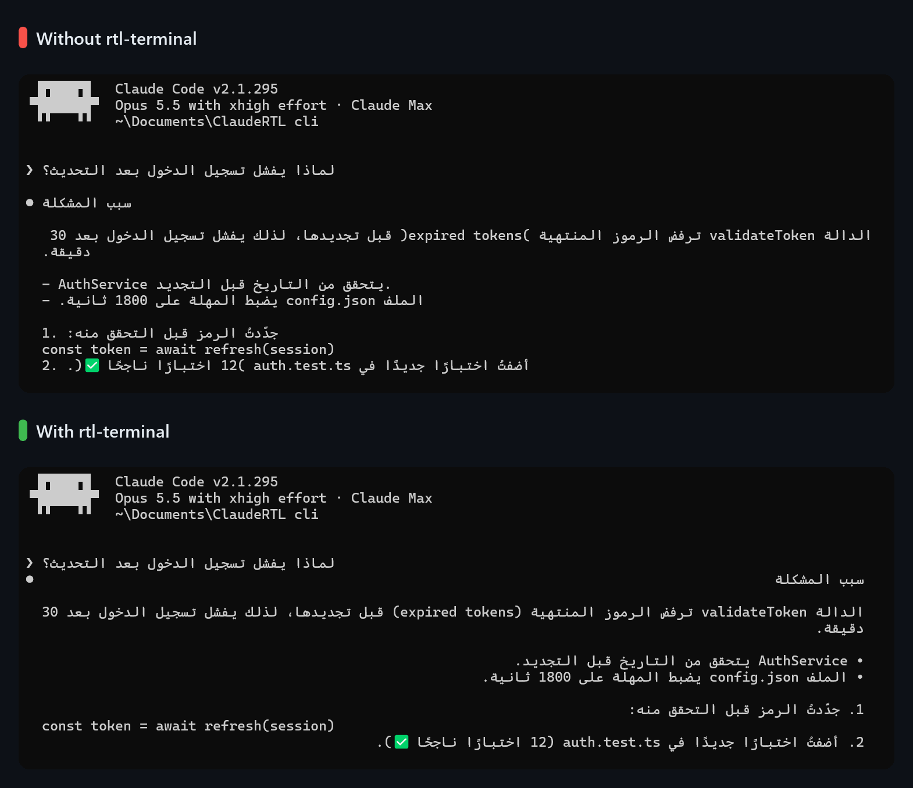
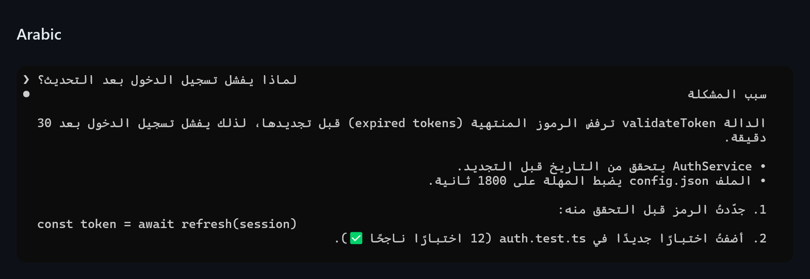
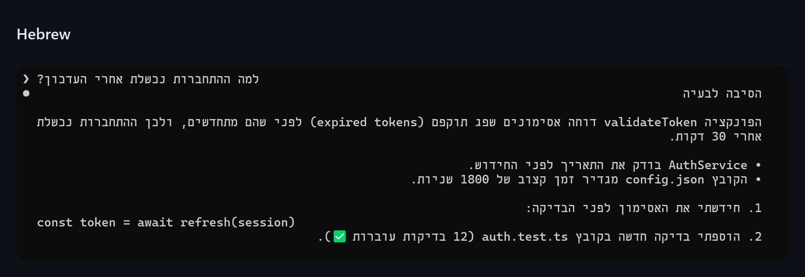
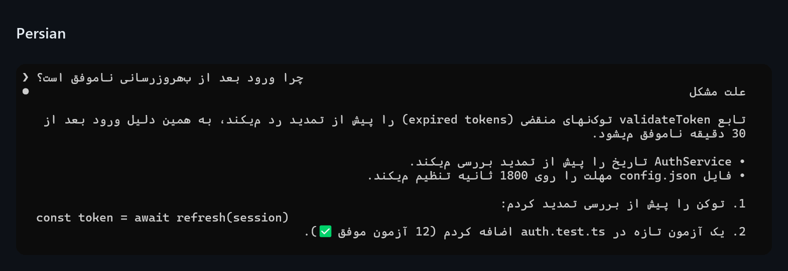
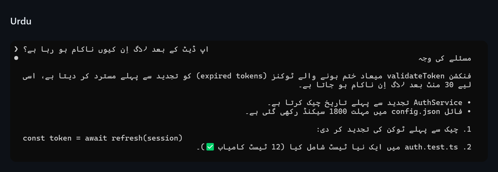
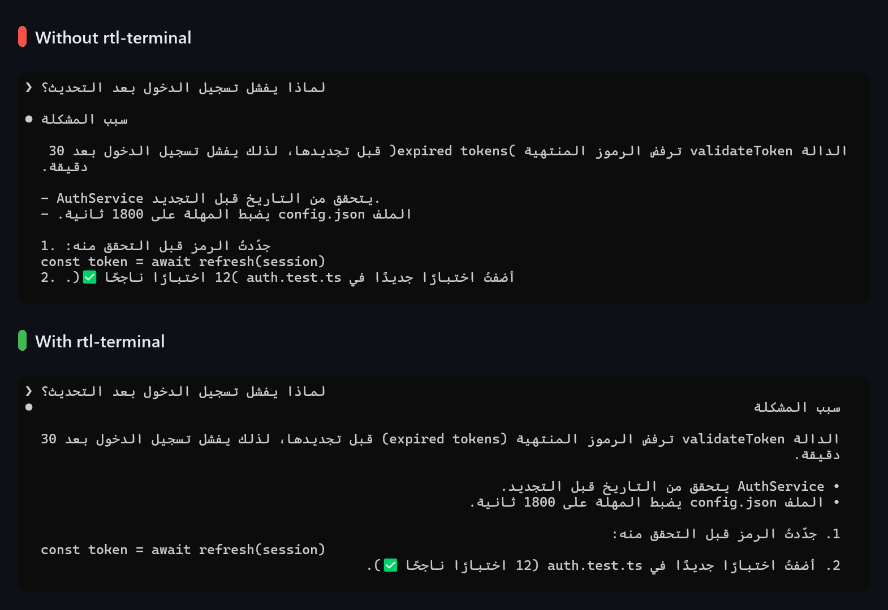
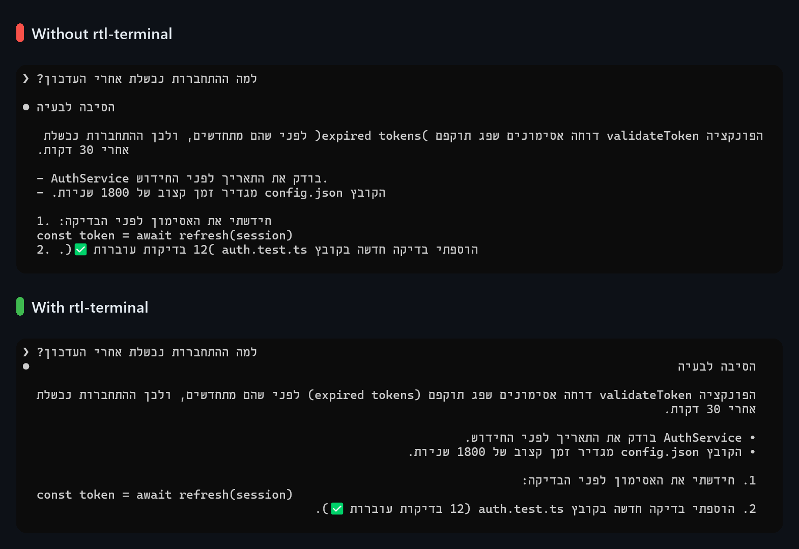
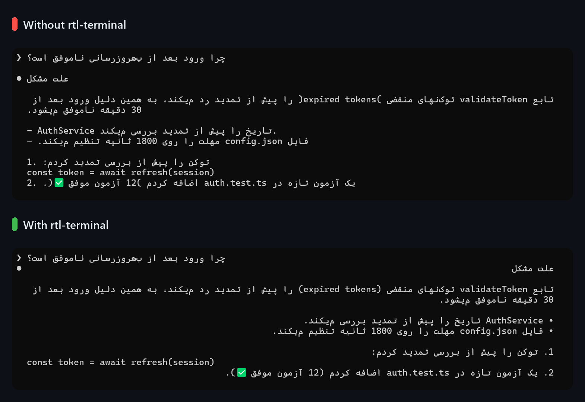
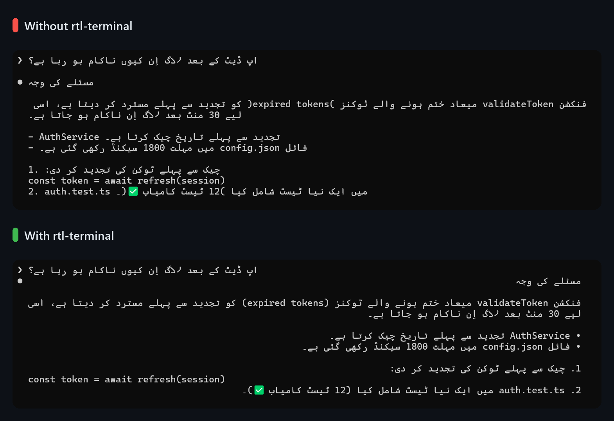

<div align="center">

# rtl-terminal

**Right-to-left text that reads right in the Claude Code terminal.**

Arabic · Hebrew · Persian · Urdu · and every other right-to-left script

[](https://github.com/MohammedSaud404/rtl-terminal/actions/workflows/checks.yml)
[](LICENSE)
[](#how-it-works)

[Installation guide](docs/INSTALL.md) · [Changelog](CHANGELOG.md) · [العربية](README.ar.md)



</div>

## Why

Claude Code draws right-to-left replies the way a left-to-right language reads: every line sits on the left, list bullets and numbers stay on the left, brackets come out backwards, and any wrapped line that starts with an English word flips its whole order.

rtl-terminal lays every right-to-left paragraph out the way a browser would:

- **Right-aligned lines**, wrapped by the plugin so each line keeps its direction, however long the paragraph.
- **Bullets, numbers and quote bars on the right**, where a right-to-left reader starts.
- **Brackets the right way round**, including pairs typed backwards on RTL keyboard layouts, like `)this(`.
- **Code, commands and links stay left-to-right**, as one readable unit inside the sentence.
- **Emoji take their real width**, so symbols like ❤ and ⚠ no longer cover the next letter.
- **Your own messages too**, plus a live preview of what you type above the input box.

Code blocks, tables and English replies are left exactly as Claude Code draws them. Only the display changes: Claude always reads your text and its replies as written.

## Gallery

| Arabic · العربية | Hebrew · עברית |
| :---: | :---: |
|  |  |
| **Persian · فارسی** | **Urdu · اردو** |
|  |  |

<details>
<summary>Before and after, for each language</summary>

<br>






</details>

Screenshots from Windows Terminal with Claude Code 2.1.295.

## Install

In Claude Code, run:

```
/plugin install rtl-terminal --marketplace MohammedSaud404/rtl-terminal
```

Answer `y` to add the marketplace, then pick the user scope. The plugin is active right away and in every new session.

Requires Claude Code 2.1.294 or later. The [installation guide](docs/INSTALL.md) covers the command line, updates, uninstalling and troubleshooting.

## Usage

It works on its own. These commands change it, and every choice is remembered across sessions:

| Command | What it does |
| --- | --- |
| `/rtl` | Turn the RTL layout on or off |
| `/rtl on` · `/rtl off` | Turn it on, or off |
| `/rtl input on` · `/rtl input off` | Show or hide the live preview above the input box |
| `/rtl mode auto` · `claude` · `terminal` | Choose who reorders RTL lines; `auto` detects it |

## Where it works

| Terminal | Result |
| --- | --- |
| Windows Terminal, conhost | ✅ Full layout |
| VS Code's integrated terminal, on Windows, macOS and Linux | ✅ Full layout |
| macOS Terminal.app, mlterm | ➖ Left to the terminal: lines that start with an RTL letter read right |
| GNOME Terminal, Konsole | ➖ Left to the terminal: every line reads left-to-right |
| xterm | ❌ No right-to-left support in the terminal itself |

**Why the difference.** In Windows Terminal, conhost and VS Code's terminal, Claude Code reorders right-to-left text itself, and that is the step this plugin controls. In other macOS and Linux terminals, Claude Code hands the text to the terminal's own bidi engine and strips the Unicode direction marks on the way, so no standard control can reach that engine. There the plugin steps aside and changes nothing. Every row of this table was verified during development, with screenshots of real terminals on Windows, macOS and Linux.

## How it works

Instead of hand-written rules, the plugin runs the full **Unicode Bidirectional Algorithm** (UAX #9), the same one browsers use, through [bidi-js](https://github.com/lojjic/bidi-js). That library passes all **91,707** cases of Unicode's own conformance test, `BidiCharacterTest.txt`, for Unicode 17, and `node scripts/conformance.mjs` re-runs the test.

For each right-to-left paragraph, the plugin:

1. Resolves the level of every character for the whole paragraph, with code and links isolated left-to-right, as browsers isolate `<code>`.
2. Wraps the paragraph into lines that fit the terminal, measuring every character the way Claude Code does, emoji sequences included.
3. Pins each run of a line between two invisible marks of its direction (RLM or LRM), and mirrors brackets at right-to-left levels, so Claude Code's simpler reordering lands exactly on the standard result.
4. Draws the lines right-aligned, with bullets and numbers on the right.

## Privacy and security

rtl-terminal only changes how text is drawn on your screen.

- **Sends nothing.** It makes no network requests, runs no commands, reads or writes no files, and has no telemetry.
- **Reads** the text Claude Code gives it to draw (replies, your messages, and your draft in the input box, for the preview), only to lay it out on screen, plus the `OS` and `TERM_PROGRAM` environment variables, to tell which terminal it runs in.
- **Stores** its own three settings (on or off, the input preview, the mode) in Claude Code's plugin storage on your machine.
- **Ships readable source**, including the original source of [bidi-js](https://github.com/lojjic/bidi-js), unmodified, and downloads nothing at install or run time.

### What it hooks

- `ui.render`, for Claude's replies, your messages and the band above the input box: draws right-to-left paragraphs laid out, puts the preview under whatever else the band shows, and leaves everything else to Claude Code.
- `prompt.edit`: reads your draft after each edit, to draw the preview. The edit itself goes on unchanged.
- `prompt.submit`: clears the preview when you send. Your prompt goes on unchanged.
- `command.run`: answers its own `/rtl` command, and no other.
- `session.start`: loads its settings, adds `/rtl`, and while a preview is shown, checks the input box every 0.3 seconds so the preview clears with the box.

## FAQ

**Copying a reply gives scrambled text.**
A mouse selection copies what is on screen, and the screen holds right-to-left text in display order. Use Claude Code's `/copy` command instead: it copies the reply's original text, in reading order.

**Why a preview above the input box, and not the box itself?**
Plugins can't redraw the input box, and anything added to its text would be sent along with your message. The preview shows your draft laid out right, without touching what is sent.

**Does it work in the Claude desktop app or the VS Code extension panel?**
Not yet. Those surfaces need a text-direction option in the plugin API, which has been requested in [anthropics/claude-code#99956](https://github.com/anthropics/claude-code/issues/99956) and [#78625](https://github.com/anthropics/claude-code/issues/78625).

## Known limitations

- Windows Terminal doesn't draw the zero-width non-joiner (ZWNJ), so Persian words like «می‌کند» show as «میکند».
- Right-to-left text nested inside English code inside a right-to-left paragraph is approximated, since Claude Code reorders with two levels only.
- Claude Code's plugin API is in early access, and future versions may need updates to this plugin.

## Development

```
claude plugin validate .
claude plugin test .
node scripts/conformance.mjs
claude --plugin-dir .
```

`.github/workflows/checks.yml` runs the strict validation, the tests and the Unicode conformance test on every push and pull request.

## Credits

[bidi-js](https://github.com/lojjic/bidi-js) 1.0.3 by Jason Johnston (MIT): its original source, vendored unmodified in `hooks/vendor/bidi-js/`.

## License

[MIT](LICENSE) © MohammedSaud404
